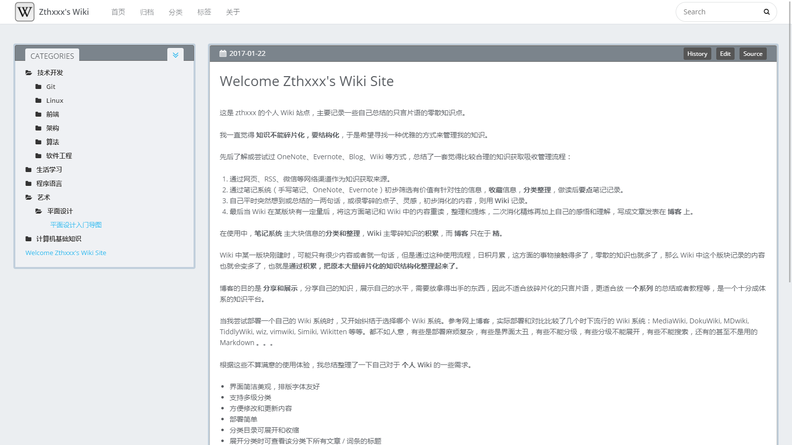

# hexo-theme-Wikitten

[中文版文档](./README_zh-CN.md)

### A personal wiki imitate [Wikitten](https://wikitten.vizuina.com/) style for Hexo. >[Preview](http://wiki.zthxxx.me/)



Applicable to personal wiki knowledge management. Simple, double column, classified management. The knowledge of multi-level sorting, the side can be expand at all levels of classification, easy to jump.

## Installation

`hexo-theme-Wikitten` kernel code base on [icarus](https://github.com/ppoffice/hexo-theme-icarus), so you can read base function document with [icarus wiki](https://github.com/ppoffice/hexo-theme-icarus/wiki).

### Install

**Wikitten theme requires Hexo 3.0 or late.**

```bash
$ cd your-hexo-directory
$ git clone https://github.com/zthxxx/hexo-theme-Wikitten.git themes/Wikitten
$ cp -rf themes/Wikitten/_source/* source/
$ cp -rf themes/Wikitten/_scaffolds/* scaffolds/
$ cp -f themes/Wikitten/_config.yml.example themes/Wikitten/_config.yml
# Last command will creat theme config form example, but remember to change personal info.
```

**Plugins requires in theme `package.json` and you need install these.**

```json
"hexo-autonofollow": "^1.0.1"	// open external links in new tab
"hexo-directory-category": "^1.0.0" // Add categories according to the article file directory
"hexo-generator-feed": "^1.2.0"	// generate Atom 1.0 or RSS 2.0 feed
"hexo-generator-json-content": "^2.2.0"	// generate a JSON content file for site search
"hexo-generator-sitemap": "^1.1.2"	// generate sitemap
"hexo-math": "^3.0.2"	// render LaTex formula
```

You can merge these plugins into the **site's** `package.json` file by `npm install ` command install them once,

Or in the **site folder**, you can install them with the following command:

```bash
$ npm install --save hexo-autonofollow
$ npm install --save hexo-directory-category
$ npm install --save hexo-generator-feed
$ npm install --save hexo-generator-json-content
$ npm install --save hexo-generator-sitemap
$ npm install --save hexo-math
```

### Enable

Modify `theme` setting in site config file `_config.yml` to **`Wikitten`**.

### Update

```bash
$ cd themes/Wikitten
$ git pull origin master
```


## Configuration

In site config file `_config.yml`, **recommend settings**:

```yaml
# Hexo Configuration
# URL
permalink: wiki/:title/

# Directory
skip_render:
  - README.md
  - '_posts/**/embed_page/**'

# Writing
new_post_name: :title.md # File name of new posts

## Markdown
## https://github.com/hexojs/hexo-renderer-marked
marked:
  gfm: true
  
## Plugins: https://hexo.io/plugins/
### JsonContent
jsonContent:
  meta: false
  pages:
    title: true
    date: true
    path: true
    text: true
    tags: true
    categories: true
  posts:
    title: true
    date: true
    path: true
    text: true
    tags: true
    categories: true
  ignore:
    - 404.html
    
### Creat sitemap
sitemap:
  path: sitemap.xml

### Adds nofollow attribute to all external links in your hexo blog posts automatically.
nofollow:
  enable: true
  exclude:
    - <your site url domain> # eg: zthxxx.me
```

In **theme** config file `Wikitten/_config.yml`, you can read more detailed commentary for some options.

**Before the start, plase first change my personal info to yourself, including options that `profile` `social_links` `history_control` and so on.**

### `profile`, `comment`, `Share` and `miscellaneous` are **DEFAULT DISABLE**! 

(You still can enable them, but not recommend.)

other **recommend settings**:

```yaml
# Customize
customize: # modify this information for yourself
    sidebar: left # sidebar position, options: left, right
    category_perExpand: false # enable article categories list per expanding
    default_index_file: index.md # if this, it will display at site index instead of default index page
    
# Widgets
widgets: # default use category only
    - category
    # - recent_posts
    # - archive
    # - tag
    # - tagcloud
    # - links
    
# History version 
history_control: # make you wiki has history version control in page (view source code, edit online, compare historical changes)
    enable: true
    server_link: https://github.com # recommend use GitHub https://github.com
    user: <your GitHub name>
    repertory: <your repertory name of this wiki source code>
    branch: <branch name of this wiki site source code>
```


## License

[MIT LICENSE](./LICENSE)


